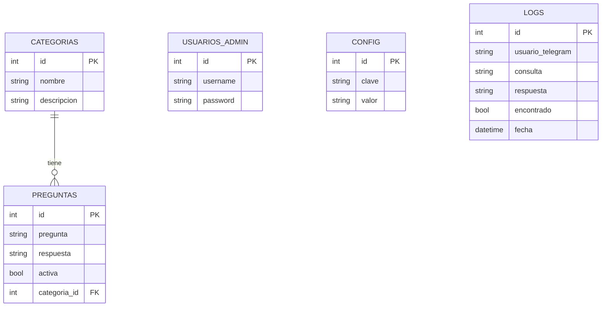

# Manual Técnico — SmartBot

## Índice

1. [Descripción general](#1-descripción-general)
2. [Patrón de arquitectura](#2-patrón-de-arquitectura)
3. [Estructura del proyecto](#3-estructura-del-proyecto)
4. [Tecnologías utilizadas](#4-tecnologías-utilizadas)
5. [Modelo de datos — Diagrama ER](#5-modelo-de-datos--diagrama-er)
6. [API REST](#6-api-rest)
7. [Configuración de Docker Compose](#7-configuración-de-docker-compose)
8. [Requerimientos funcionales](#8-requerimientos-funcionales)
9. [Requerimientos no funcionales](#9-requerimientos-no-funcionales)
10. [Posibles mejoras futuras](#10-posibles-mejoras-futuras)

---

## 1. Descripción general

SmartBot es un sistema de respuestas automatizadas compuesto por tres servicios independientes que trabajan en conjunto:

- **API REST** (FastAPI): gestiona la lógica de negocio, la base de datos y sirve el panel administrativo.
- **Bot de Telegram** (python-telegram-bot): recibe mensajes de usuarios y consulta la API para responder.
- **Base de datos** (PostgreSQL): almacena preguntas, respuestas, categorías, configuración y registros.

---

## 2. Patrón de arquitectura

El sistema utiliza una arquitectura de **tres capas (3-Tier Architecture)** combinada con el patrón **cliente-servidor REST**.

```
┌─────────────────────────────────────────────────────────┐
│                     CAPA DE PRESENTACIÓN                │
│                                                         │
│   ┌───────────────────┐     ┌───────────────────────┐  │
│   │  Usuario Telegram │     │  Administrador (web)  │  │
│   │  (cliente bot)    │     │  Panel Admin HTML      │  │
│   └────────┬──────────┘     └──────────┬────────────┘  │
└────────────┼──────────────────────────┼────────────────┘
             │ mensajes                 │ HTTP/formularios
┌────────────┼──────────────────────────┼────────────────┐
│            ▼     CAPA DE NEGOCIO      ▼                │
│   ┌────────────────┐       ┌──────────────────────┐   │
│   │  Bot Service   │──────▶│    FastAPI REST API   │   │
│   │  (polling)     │ HTTP  │  + Panel Admin Jinja2 │   │
│   └────────────────┘       └──────────┬───────────┘   │
└────────────────────────────────────────┼───────────────┘
                                         │ SQLAlchemy ORM
┌────────────────────────────────────────┼───────────────┐
│                CAPA DE DATOS           ▼               │
│              ┌──────────────────────────────┐          │
│              │       PostgreSQL 15           │          │
│              │  categorias | preguntas       │          │
│              │  usuarios_admin | config      │          │
│              │  logs                         │          │
│              └──────────────────────────────┘          │
└────────────────────────────────────────────────────────┘
```

### Flujo de una consulta del bot

```
Usuario escribe mensaje
        │
        ▼
Bot recibe update vía getUpdates (long polling)
        │
        ▼
Bot hace GET /consulta?q=<texto> a la API
        │
        ▼
API busca con ILIKE en tabla preguntas (activa=true)
        │
    ┌───┴────┐
    │        │
Encontró   No encontró
    │        │
    ▼        ▼
Devuelve  Devuelve mensaje
respuesta  de fallback
    │        │
    └───┬────┘
        ▼
Bot responde al usuario en Telegram
```

---

## 3. Estructura del proyecto

```
practica2/
├── docker-compose.yml          # Orquestación de los 3 servicios
├── .env                        # Variables de entorno (NO en Git)
├── .env.example                # Plantilla de variables de entorno
│
├── api/                        # Servicio FastAPI + Panel Admin
│   ├── Dockerfile
│   ├── requirements.txt
│   ├── main.py                 # Punto de entrada, middleware, routers
│   ├── database.py             # Conexión SQLAlchemy, Base, get_db
│   ├── models.py               # Modelos ORM (tablas)
│   ├── dependencies.py         # Dependencias compartidas (sesión)
│   ├── seed.py                 # Script de datos iniciales (manual)
│   ├── routes/
│   │   ├── auth.py             # Login / logout
│   │   ├── categorias.py       # CRUD categorías (API JSON)
│   │   ├── preguntas.py        # CRUD preguntas (API JSON)
│   │   ├── consulta.py         # Endpoint de búsqueda para el bot
│   │   ├── config.py           # Configuración del chat ID
│   │   └── panel.py            # Rutas HTML del panel administrativo
│   ├── templates/
│   │   ├── base.html           # Layout base con sidebar
│   │   ├── login.html
│   │   ├── dashboard.html
│   │   ├── preguntas.html
│   │   ├── pregunta_form.html
│   │   ├── categorias.html
│   │   ├── categoria_form.html
│   │   └── config.html
│   └── static/                 # CSS y JS del panel
│
└── bot/                        # Servicio del bot de Telegram
    ├── Dockerfile
    ├── requirements.txt
    └── main.py                 # Handlers y configuración del bot
```

---

## 4. Tecnologías utilizadas

| Tecnología | Versión | Rol |
|---|---|---|
| Python | 3.11 | Lenguaje principal |
| FastAPI | última | Framework del backend y API REST |
| Uvicorn | última | Servidor ASGI para FastAPI |
| SQLAlchemy | última | ORM — mapeo de objetos a tablas |
| psycopg2-binary | última | Driver Python para PostgreSQL |
| Jinja2 | última | Motor de plantillas HTML para el panel |
| Starlette SessionMiddleware | última | Manejo de sesiones HTTP |
| passlib 1.7.4 | fijada | Hashing de contraseñas (bcrypt) |
| bcrypt 4.0.1 | fijada | Backend de hashing |
| python-telegram-bot | última | Librería para el bot de Telegram |
| httpx | última | Cliente HTTP async para el bot |
| PostgreSQL | 15 | Base de datos relacional |
| Docker | — | Contenedores de los servicios |
| Docker Compose | — | Orquestación de servicios |

> **Nota:** passlib y bcrypt están fijadas en versiones específicas por incompatibilidad entre versiones recientes de ambas librerías.

---

## 5. Modelo de datos — Diagrama ER



### Descripción de tablas

| Tabla | Descripción |
|---|---|
| `categorias` | Agrupa las preguntas por tema. Cada categoría tiene nombre y descripción. |
| `preguntas` | Almacena cada FAQ con su respuesta. El campo `activa` permite desactivar una pregunta sin eliminarla. La relación con `categorias` es opcional (categoria_id puede ser NULL). |
| `usuarios_admin` | Credenciales de acceso al panel. La contraseña se almacena como hash bcrypt. |
| `config` | Configuración del sistema en formato clave-valor. Actualmente almacena `telegram_chat_id`. |
| `logs` | Registro de cada consulta realizada por usuarios del bot, con fecha, usuario, texto enviado y respuesta dada. |

---

## 6. API REST

Base URL: `http://localhost:8000`

La documentación interactiva está disponible en `/docs` (Swagger UI) cuando el proyecto está corriendo.

### Autenticación

| Método | Ruta | Descripción |
|---|---|---|
| GET | `/login` | Formulario de login (HTML) |
| POST | `/login` | Procesar login, crear sesión |
| GET | `/logout` | Cerrar sesión y redirigir |

### Categorías

| Método | Ruta | Auth | Descripción |
|---|---|---|---|
| GET | `/categorias/` | No | Listar todas las categorías |
| GET | `/categorias/{id}` | No | Obtener categoría por ID |
| POST | `/categorias/` | Sí | Crear nueva categoría |
| PUT | `/categorias/{id}` | Sí | Actualizar categoría |
| DELETE | `/categorias/{id}` | Sí | Eliminar categoría |

### Preguntas

| Método | Ruta | Auth | Descripción |
|---|---|---|---|
| GET | `/preguntas/` | No | Listar preguntas (filtro opcional: `?categoria_id=1`) |
| GET | `/preguntas/{id}` | No | Obtener pregunta por ID |
| POST | `/preguntas/` | Sí | Crear nueva pregunta |
| PUT | `/preguntas/{id}` | Sí | Actualizar pregunta |
| DELETE | `/preguntas/{id}` | Sí | Eliminar pregunta |

### Consulta del bot

| Método | Ruta | Auth | Descripción |
|---|---|---|---|
| GET | `/consulta?q=texto` | No | Buscar respuesta para el texto enviado por el usuario |

**Respuesta cuando encuentra:**
```json
{
  "encontrado": true,
  "respuesta": "Nuestro horario es de lunes a viernes de 8:00 a 17:00 horas.",
  "pregunta_id": 1
}
```

**Respuesta cuando no encuentra:**
```json
{
  "encontrado": false,
  "respuesta": "No encontré información sobre eso. Puedes intentar reformular tu consulta o escribir /categorias para ver los temas disponibles."
}
```

### Configuración

| Método | Ruta | Auth | Descripción |
|---|---|---|---|
| GET | `/config/chat_id` | No | Obtener el chat ID configurado |
| PUT | `/config/chat_id` | Sí | Actualizar el chat ID |

### Salud del servicio

| Método | Ruta | Descripción |
|---|---|---|
| GET | `/health` | Verificar que la API está corriendo |

---

## 7. Configuración de Docker Compose

El proyecto utiliza tres servicios definidos en `docker-compose.yml`:

```yaml
services:
  db:        # PostgreSQL 15
  api:       # FastAPI en puerto 8000
  bot:       # Bot de Telegram (polling)
```

### Variables de entorno requeridas (`.env`)

```env
TELEGRAM_TOKEN=<token del bot desde BotFather>
ADMIN_USER=IA1-User
ADMIN_PASSWORD=IA1-password@_new
DB_USER=postgres
DB_PASSWORD=postgres
SECRET_KEY=<clave secreta para las sesiones>
```

### Dependencias entre servicios

- `api` espera a que `db` esté saludable (healthcheck con `pg_isready`)
- `bot` espera a que `api` esté disponible

### Comandos principales

```bash
# Levantar todos los servicios
docker compose up -d

# Reconstruir imágenes (después de cambios en el código)
docker compose up --build -d

# Poblar la base de datos (solo la primera vez)
docker compose exec api python seed.py

# Ver logs de un servicio
docker compose logs api -f
docker compose logs bot -f

# Detener todo
docker compose down

# Detener y eliminar volúmenes (DB incluida)
docker compose down -v
```

---

## 8. Requerimientos funcionales

| ID | Requerimiento |
|---|---|
| RF-01 | El sistema debe permitir a los usuarios enviar mensajes de texto al bot de Telegram y recibir respuestas automáticas. |
| RF-02 | El bot debe buscar la respuesta más relevante en la base de datos usando coincidencia parcial de texto (ILIKE). |
| RF-03 | Si no existe respuesta para una consulta, el bot debe responder con un mensaje de fallback. |
| RF-04 | El bot debe responder a los comandos `/start`, `/ayuda` y `/categorias`. |
| RF-05 | El sistema debe contar con un panel administrativo accesible desde el navegador. |
| RF-06 | El acceso al panel administrativo debe requerir autenticación con usuario y contraseña. |
| RF-07 | El administrador debe poder crear, consultar, actualizar y eliminar preguntas frecuentes. |
| RF-08 | El administrador debe poder crear, consultar, actualizar y eliminar categorías. |
| RF-09 | El administrador debe poder activar o desactivar preguntas sin eliminarlas. |
| RF-10 | El administrador debe poder configurar el ID del grupo o chat de Telegram desde el panel. |
| RF-11 | El sistema debe tener al menos 20 preguntas frecuentes precargadas en la base de datos. |
| RF-12 | Las preguntas deben estar organizadas en al menos 3 categorías. |
| RF-13 | Debe existir un usuario administrador preconfigurado con credenciales `IA1-User` / `IA1-password@_new`. |
| RF-14 | Las contraseñas de administradores deben almacenarse como hash bcrypt, nunca en texto plano. |
| RF-15 | El proyecto debe ejecutarse completamente con `docker compose up`. |

---

## 9. Requerimientos no funcionales

| ID | Categoría | Requerimiento |
|---|---|---|
| RNF-01 | Seguridad | Las contraseñas se almacenan como hash bcrypt. Ninguna credencial está en el código fuente. |
| RNF-02 | Seguridad | Las variables sensibles (token, contraseñas, clave de sesión) se gestionan exclusivamente mediante variables de entorno. |
| RNF-03 | Seguridad | El archivo `.env` está excluido del repositorio mediante `.gitignore`. |
| RNF-04 | Seguridad | El panel administrativo está protegido por sesión HTTP firmada con `SECRET_KEY`. |
| RNF-05 | Disponibilidad | Los servicios `api` y `bot` tienen `restart: always` en Docker Compose, reiniciándose automáticamente ante fallos. |
| RNF-06 | Disponibilidad | La API no arranca hasta que la base de datos supera el healthcheck (`pg_isready`). |
| RNF-07 | Mantenibilidad | El código está modularizado en archivos independientes por responsabilidad (`routes/`, `models.py`, `database.py`). |
| RNF-08 | Mantenibilidad | Las preguntas y respuestas se gestionan desde la base de datos, sin valores hardcodeados en el código. |
| RNF-09 | Rendimiento | Las búsquedas de consultas usan índices implícitos de PostgreSQL y operaciones ILIKE acotadas a preguntas activas. |
| RNF-10 | Usabilidad | El panel administrativo es responsive y funciona en navegadores modernos sin instalar software adicional. |
| RNF-11 | Portabilidad | El proyecto corre en cualquier sistema con Docker instalado, sin depender del sistema operativo del host. |
| RNF-12 | Trazabilidad | El repositorio contiene historial de commits que refleja el avance progresivo del desarrollo. |

---

## 10. Posibles mejoras futuras

- **Registro de consultas activo:** Guardar cada consulta del bot en la tabla `logs` con usuario, texto, respuesta y fecha.
- **Estadísticas en el dashboard:** Mostrar consultas más frecuentes, usuarios activos y categorías más consultadas.
- **Búsqueda mejorada:** Implementar búsqueda por similitud (trigrams de PostgreSQL) para tolerancia a errores tipográficos.
- **Múltiples administradores:** Permitir crear y gestionar más de un usuario administrador desde el panel.
- **Notificaciones proactivas:** Usar el chat ID configurado para que el bot envíe mensajes al grupo sin esperar consultas.
- **Autenticación JWT:** Migrar el panel a una SPA con JWT si se necesita una interfaz más moderna.
- **Despliegue en nube:** Desplegar en Railway o Oracle Cloud Free Tier para acceso público continuo.
